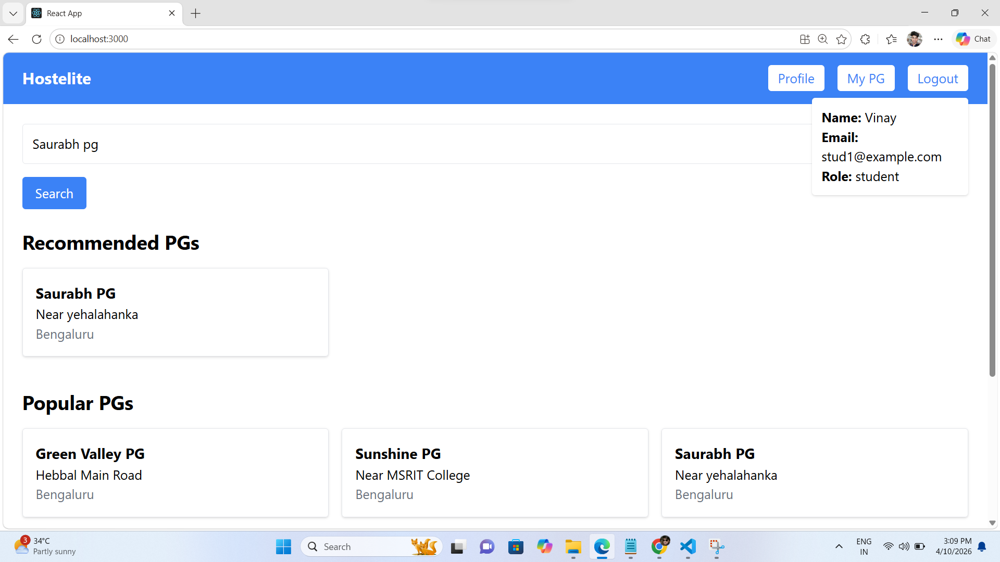
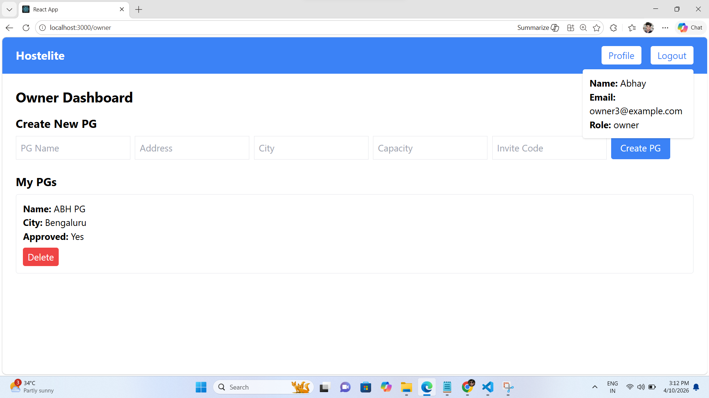
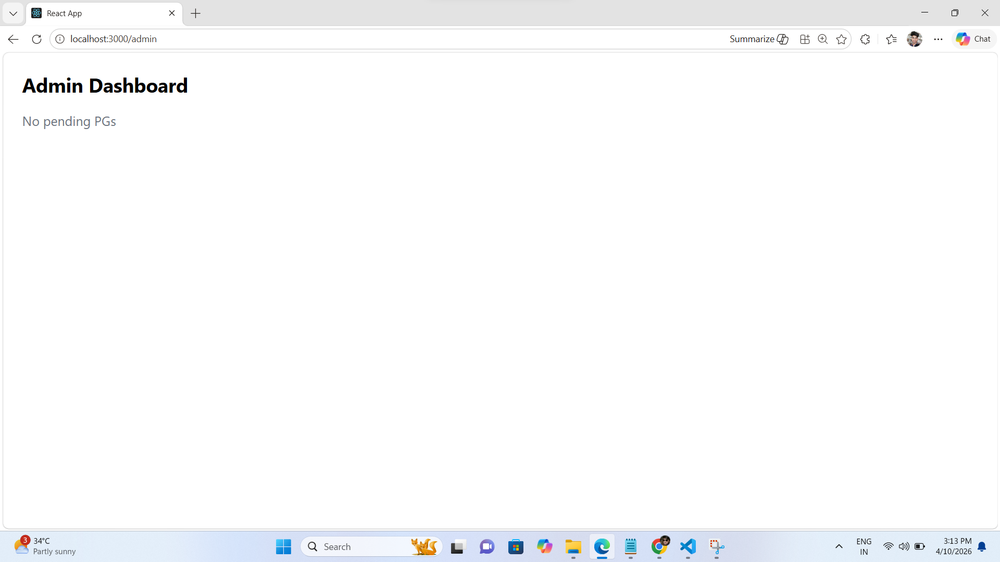

🏠 Hostelite - PG Management System

A full-stack PG/Hostel Management System built using MERN stack.

---

🚀 Features

👨‍🎓 Student

- Register & Login
- Search PGs
- Apply for PG
- Upload payment screenshot
- Raise complaints

👑 Owner

- Create PG
- Approve student requests
- View payments & verify screenshots
- Manage complaints

🛡️ Admin

- Approve PG listings

---

🧠 Tech Stack

- Frontend: React.js
- Backend: Node.js, Express.js
- Database: MongoDB
- Authentication: JWT
- File Upload: Cloudinary

---

⚙️ How to Run

Backend

cd backend
npm install
npm run dev

Frontend

cd frontend
npm install
npm start

---

## 📸 Screenshots

### 🏠 Home

### 🏢 PG Details

### 👑 Owner Dashboard

### 🛡️ Admin Dashboard

👨‍💻 Author

Prashant Kumar Upadhyay